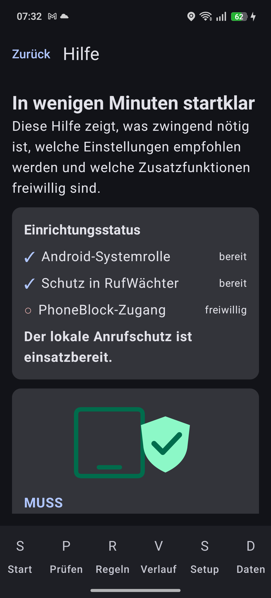

# RufWächter


RufWächter ist eine native Android-App zur lokalen Bewertung eingehender Anrufe. Sie verwendet Androids offizielle `CallScreeningService`-Schnittstelle, persönliche Regeln, lokale Reputationsdaten, Carrier-Verifikation und ein deterministisches Scoring. Die Kernfunktion funktioniert ohne Konto und ohne Netzwerk.

## Funktionsumfang

- Anfordern und Prüfen der Systemrolle `ROLE_CALL_SCREENING`
- Zulassen, Warnen, Stummschalten und Blockieren anhand lokaler Regeln
- Fail-open-Verhalten bei internen Fehlern oder überschrittenem internem Zeitbudget
- exakte, temporäre, Präfix-, Länder-, Privat- und Unbekannt-Regeln
- lokale Room-Datenbank für Regeln, Reputation, Feed-Metadaten und eigenen Entscheidungsverlauf
- atomarer JSON-Reputationsimport über den Storage Access Framework
- optionaler HTTPS-Feed über WorkManager; im Anrufpfad findet kein Netzwerkzugriff statt
- optionale PhoneBlock-Community-Datenbank mit versioniertem Voll- und Inkrementalabgleich
- verschlüsselte PhoneBlock-Anmeldung und ausdrücklich aktivierbare Meldung eigener Sperren
- Import exportierter Telefon-Sperrlisten aus Text, CSV oder JSON
- Nummernprüfung, Benutzerkorrekturen, Datenexport und vollständige lokale Löschung
- bebilderte In-App-Hilfe mit Einrichtungsstatus, Empfehlungen und direkten Aktionen
- Material-3-Oberfläche, System/Light/Dark-Darstellung und deutsche Texte

## Bebilderte Hilfe

„Hilfe“ ist von jeder Hauptseite über die Kopfleiste erreichbar; auf der Übersicht gibt es zusätzlich
„Bebilderte Hilfe öffnen“. Die Hilfe unterscheidet erforderliche, empfohlene und freiwillige Schritte,
zeigt den aktuellen Status von Systemrolle, Schutz und PhoneBlock und führt direkt zu den passenden
Einstellungen. Alle sechs Illustrationen sind lokale Vektorgrafiken mit zugänglichen
Bildbeschreibungen; es werden dafür keine Daten geladen.



## Datenschutz

Standardmäßig sind Online-Updates und PhoneBlock ausgeschaltet. Die App fordert keinen Zugriff auf Kontakte, SMS, Standort, das allgemeine System-Anrufprotokoll oder den geschützten Android-Sperrlisten-Provider an. Der eigene Entscheidungsverlauf enthält die bewertete Nummer, weil er eine Kernfunktion ist; er ist löschbar und zeitlich begrenzt. Details stehen in [PRIVACY_POLICY.md](PRIVACY_POLICY.md).

## PhoneBlock

Unter „Einstellungen“ können ein PhoneBlock-API-Schlüssel oder die älteren Basic-Zugangsdaten hinterlegt werden. Sie werden mit einem nicht exportierbaren AES-GCM-Schlüssel aus dem Android Keystore verschlüsselt und im `noBackupFilesDir` gespeichert. Die App lädt zunächst einen Vollstand von `https://phoneblock.net/phoneblock/api/blocklist` und verwendet anschließend höchstens einmal täglich den von PhoneBlock vorgesehenen `since`-Abgleich. Ein erneuter Vollstand erfolgt frühestens nach 30 Tagen.

Die freiwillige Teilnahme ist ein eigener, standardmäßig ausgeschalteter Schalter. Nur dann werden manuell gesperrte Nummer, ausgewählte Bewertungskategorie und Notiz an `/rate` gesendet. Anrufverlauf und automatisch eingehende Anrufe werden nicht gemeldet. Zugangsdaten sind nie Bestandteil eines Datenexports.

Android erlaubt den Zugriff auf die systemweite Sperrliste nur System-, Standard-Telefon-/SMS- und privilegierten Provider-Apps. RufWächter fordert diese nicht erteilbare Berechtigung nicht an. Bereits vorhandene Android-Sperren bleiben im System wirksam; eine vom Telefonhersteller exportierte Nummernliste kann unter „Datenschutz“ importiert werden.

## Voraussetzungen

- JDK 17
- Android SDK Platform 36 und Build Tools 36.0.0
- Internetzugriff beim erstmaligen Auflösen der gepinnten Gradle-Abhängigkeiten

## Build

Windows PowerShell:

```powershell
.\scripts\build_debug.ps1
```

Linux/macOS:

```bash
./scripts/build_debug.sh
```

Einzelne Prüfungen:

```powershell
.\gradlew.bat clean
.\gradlew.bat lintDebug
.\gradlew.bat testDebugUnitTest
.\gradlew.bat assembleDebug
.\gradlew.bat bundleRelease
```

## Installation

```powershell
adb install -r .\app\build\outputs\apk\debug\app-debug.apk
```

Danach RufWächter öffnen und auf der Übersicht „Schutz im System aktivieren“ wählen. Android zeigt den offiziellen Rollendialog. Einige Hersteller ergänzen eigene Akku- oder Telefon-App-Einstellungen; RufWächter kann diese nicht umgehen. Bei Dual-SIM- oder stark angepassten Telefon-Apps ist ein realer Gerätetest erforderlich.

## Importformat

Ein Reputationsfeed ist UTF-8-JSON mit `schemaVersion: 1`, Quellmetadaten und höchstens 50.000 Einträgen. Die Datei ist auf 5 MiB begrenzt. Ein vollständiges Beispiel liegt unter [sample-data/sample_reputation_feed.json](sample-data/sample_reputation_feed.json). Doppelte Nummern und ungültige Einträge werden nachvollziehbar verworfen; erst nach erfolgreicher Gesamtprüfung erfolgt eine Transaktion.

## Release

`bundleRelease` erzeugt ein unsigniertes beziehungsweise mit der lokalen Standardkonfiguration gebautes AAB zur technischen Prüfung. Eine Produktionssignatur wird bewusst nicht im Repository erzeugt oder abgelegt. Vor Veröffentlichung sind Play-Regeln, Store-Medien und eine externe Datenschutz-URL erneut zu prüfen.

## Projektstruktur

- `app/src/main/java/.../domain`: Android-arme Entscheidungslogik
- `screening`: Systemadapter, Snapshot und Benachrichtigungen
- `data`: Room-Schema, DAO und Repository
- `settings`: DataStore
- `importexport`, `reputation` und `phoneblock`: sichere Feeds, Export, PhoneBlock und WorkManager
- `ui`: Compose-Zustand und Theme
- `docs`: Architektur, Tests, Sicherheit und Bedienung
- `sample-data`: validierte Beispieldateien
- `scripts`: reproduzierbare Build- und Prüfskripte

Instrumentierte Tests werden auf einem angeschlossenen Android-Gerät ausgeführt; Details stehen im Release-Bericht.
